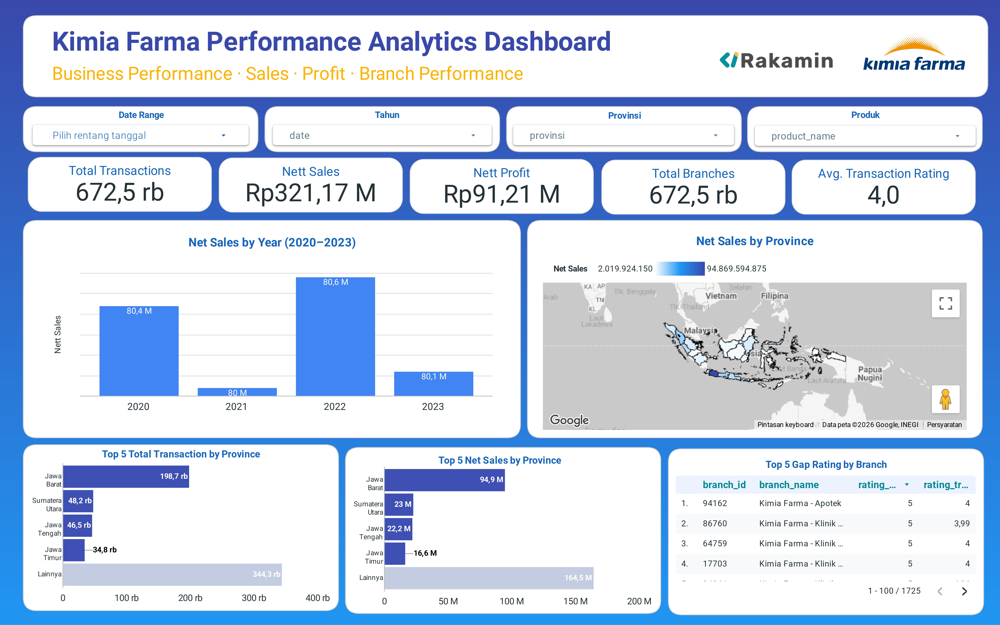

# Kimia Farma Big Data Analytics

## Project Overview

This project analyzes Kimia Farma transaction data from 2020 to 2023 using Google BigQuery and Looker Studio. The analysis covers transaction performance, net sales, net profit, branch performance, customer ratings, and regional distribution.

## Project Objectives

- Build an analytical table from four source tables.
- Calculate net sales and net profit for each transaction.
- Analyze annual sales performance.
- Identify provinces and branches with the strongest performance.
- Develop an interactive Looker Studio dashboard.

## Data Sources

The analysis uses four tables:

- `kf_final_transaction`
- `kf_inventory`
- `kf_kantor_cabang`
- `kf_product`

The resulting analytical table is:

- `kf_analysis`

## Tools

- Google BigQuery
- SQL
- Looker Studio
- GitHub

## Key Calculations

### Net Sales

`nett_sales = actual_price × (1 - discount_percentage)`

### Net Profit

`nett_profit = nett_sales × gross_profit_percentage`

Gross-profit percentages:

- Price ≤ Rp50,000: 10%
- Rp50,001–Rp100,000: 15%
- Rp100,001–Rp300,000: 20%
- Rp300,001–Rp500,000: 25%
- Price > Rp500,000: 30%

## Data Validation

- Total rows: 672,458
- Unique transactions: 672,458
- Missing branch joins: 0
- Missing product joins: 0
- Analysis period: 2020–2023

## Dashboard Preview

## Repository Structure

- `sql/`: SQL transformation and analytical queries
- `dashboard/`: Looker Studio dashboard preview
- `docs/`: Data dictionary and documentation

Haidar Aqil Falah  
Development Economics Student, Universitas Negeri Semarang
